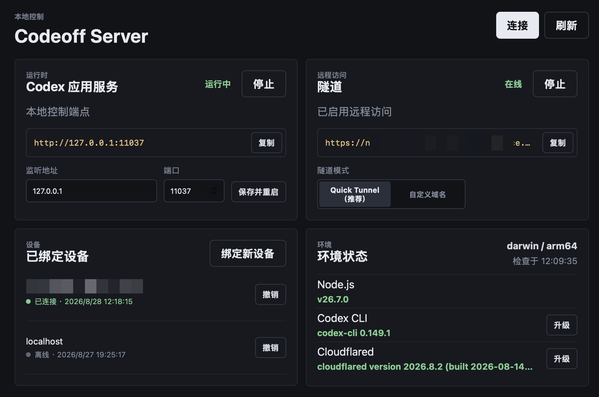
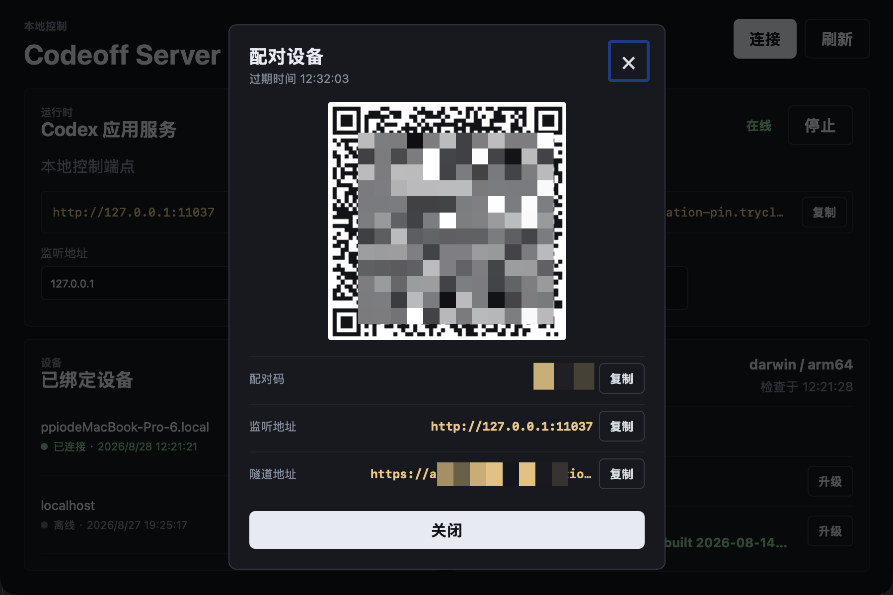

<p align="center">
  
</p>

<h1 align="center">Codeoff Server</h1>

<p align="center">
  <a href="https://github.com/MaimoryLab/codeoff-server/actions/workflows/ci-test.yml"></a>
  <a href="https://github.com/MaimoryLab/codeoff-server/actions/workflows/build-artifacts.yml"></a>
  <a href="https://github.com/MaimoryLab/codeoff-server/releases/latest"></a>
  <a href="https://github.com/MaimoryLab/codeoff-server"></a>
</p>
<p align="center">
  <a href="README.zh-CN.md">中文</a>
</p>

Codeoff Server is a local-first desktop bridge for controlling Codex from a phone. The Wails 3 application owns the local control API, environment checks, Codex app-server process, and Cloudflare Tunnel. Pair it with [Codeoff Mobile](https://github.com/MaimoryLab/codeoff) to work from a mobile device.

## Screenshots

<table align="center">
    <tr>
      <td></td>
      <td></td>
    </tr>
</table>

## Usage

### 1. Install dependencies

- Install Node.js and the Codex CLI. Codeoff Server checks Node.js as a local dependency and uses Codex CLI for the local app-server.
- Install `cloudflared` only when the phone must connect from outside the local network. It is optional for local-network use.
- Launch Codeoff Server and use **Refresh** to confirm the versions in **Environment status**. Supported dependencies can also be installed or upgraded from the panel.

### 2. Start the services

1. Start the Codex app-server in the desktop panel.
2. For remote access, start the Cloudflare Tunnel. **Quick Tunnel** is the simplest option; a custom domain is described below.

### 3. Pair a device

1. Click **Bind new device** in the desktop panel.
2. Recommended: open Codeoff Mobile, tap the QR scanner, and scan the pairing QR code. The app reads the server address and one-time pairing code automatically.
3. Manual: copy a listening address or Tunnel address and the pairing code. In Codeoff Mobile, enter the address, tap **Connect**, then enter the pairing code and device name when prompted.

### 4. Connect and work

After pairing, Codeoff Mobile stores the device token in secure storage and can reconnect without pairing again. Use it to browse threads, send turns, upload files, and respond to approvals.

### 5. Add a custom domain

In the **Tunnel** section, choose **Custom domain**, enter the URL of an existing Cloudflare application Tunnel, and save the setting. Start the Tunnel after saving it. Use **Quick Tunnel** when no stable domain is needed.

### 6. Prevent system sleep

Open the Codeoff Server menu bar item and enable **Prevent system sleep**. The sleep inhibitor is active while the Codex app-server is running.

## How it works

1. The desktop app checks local dependencies, starts the Codex app-server, and binds the control API.
2. Cloudflare Tunnel publishes the control API origin and the panel shows a one-time pairing code.
3. Codeoff Mobile exchanges that code at `POST /api/v1/pair/exchange`, then authenticates the `/api/v1/ws` WebSocket with the returned device token.
4. The server forwards thread, turn, upload, and approval operations to the Codex app-server and streams its events back to connected devices.
5. The optional CLI daemon uses the same control components without the Wails desktop UI.

## Quickstart

### Use

#### Download a release

Download the latest package from [Releases](https://github.com/MaimoryLab/codeoff-server/releases/latest):

- macOS: choose the `.dmg` matching `amd64` (Intel) or `arm64` (Apple Silicon).
- Windows: choose the matching `-installer.exe`.
- Linux: choose the matching `.deb`, `.rpm`, or `.pkg.tar.zst`.

The release also includes platform OTA archives named `ota-codeoff-server-<platform>-<arch>.zip`.

Install and launch Codeoff Server, start the Codex app-server, and start the Cloudflare Tunnel only when remote access is needed. Then copy the displayed address and one-time pairing code into Codeoff Mobile.

#### CLI daemon (optional)

Release packages are the desktop app. For a Wails-free deployment, build the daemon and CLI from source as described below.

### Develop

#### Requirements

- Go `1.27+`
- Node.js and pnpm
- Wails 3 CLI `v3.0.0-beta.14`
- Installed `codex` binary and, optionally, `cloudflared` for remote access (the desktop panel can install supported dependencies after an explicit action)

Install the pinned Wails CLI once:

```sh
go install github.com/wailsapp/wails/v3/cmd/wails3@v3.0.0-beta.14
```

#### Run the desktop app

```sh
pnpm --dir frontend install
wails3 dev
```

#### Build and check

```sh
wails3 build
go vet ./...
go test -race ./...
staticcheck ./...
```

The generated desktop binary is written to `bin/codeoff-server`.

#### Build and run the CLI daemon

```sh
go build -o bin/codeoff-daemon ./cmd/codeoff-daemon
go build -o bin/codeoff-cli ./cmd/codeoff-cli
bin/codeoff-daemon --listen 0.0.0.0:11037 --cf-tunnel --cf-tunnel-mode quick
bin/codeoff-cli status
bin/codeoff-cli connect
bin/codeoff-cli pair
bin/codeoff-cli devices
bin/codeoff-cli restart appserver
bin/codeoff-cli restart tunnel
```

CLI parameters:

- `--state PATH`: override the daemon state file.
- `--json`: print machine-readable JSON instead of human-readable output.
- `--qr-dir DIR`: write connection or pairing QR PNG files to a directory. Without it, the QR is rendered in the terminal.
- `--qr-terminal`: render the QR in the terminal even when `--qr-dir` is also set.

Commands accept `status`, `devices`, `connect`, `pair`, `revoke DEVICE_ID`, `restart appserver|tunnel`, and `shutdown`.

Use `--cf-tunnel-mode external --cf-tunnel-url https://example.com` for an existing Cloudflare application tunnel. Override the daemon state file with `--state PATH`.

## Related project

- [Codeoff Mobile](https://github.com/MaimoryLab/codeoff): Flutter client for the desktop bridge.

## License

[Apache License 2.0](LICENSE)
